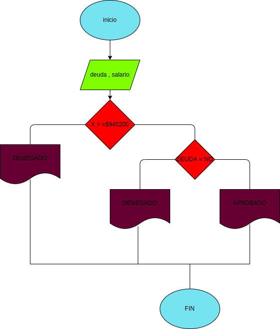

# prestamo bancario
programa para hacer un prestamo bancario si tiene un sueldo mayor a $945200 y si no tiene ninguna deuda

# ANALISIS
variables de entrada
.sueldo
.deuda

variables de proceso
.si su salario es menor el prestamo es denegado
.si su salario es mayor o igual pero tiene deudas es denegado
.si su salario es mayor o igual y no tiene deudas el prestamo es aprobado
 
variables de salida
tien un prestamo 
no tiene el prestamo

# DISEÑO

# CONSTRUCCION 
