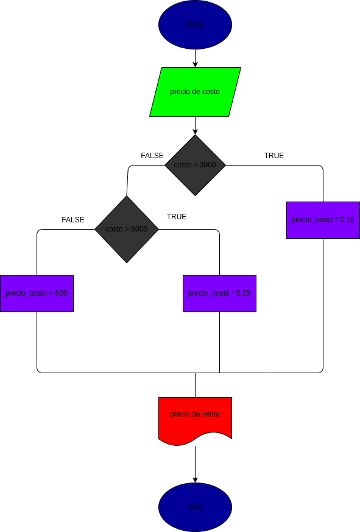

# precio de venta de los articulos

programa para calcular el precio de un producto con su gtanancia

# ANALISIS

variables de entrada
precio de costo

variables de proceso
si el precio es menor a $3000 tiene de ganancia el 15%
si el precio es mayor a $6000 tiene de ganancia el 25%
si el precio esta entre $3000 y $6000 tiene una ganancia de $500
variables de salida
precio de venta

# DISEÑO

# CONSTRUCCION 
