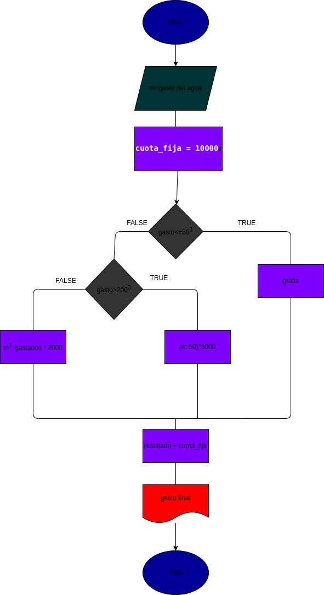

# gasto_agua

programa para calcular cuanto tiene que pagar al mes por la cantidad de agua que gasta

# ANLISIS

variables de entrada

- cantidad de agua que gasta

variables de proceso
- cuota fija = $10000
- cuota entre 50m a 200m = $2000
- cuota dde 200 en adelante = $3000

variables de salida
- cantidad a pagar

# DISEÑO

