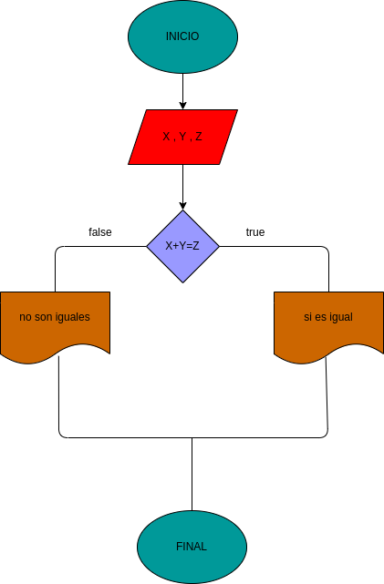

# suma_dos_numero_igual_tercero
hacer un programa que reciba tres numeros y determine si la suma de los dos primeros es igual al tercero

# ANALISIS
variables de entrada 
X , Y ,Z

variables de proceso
suma de x + y

variables de salida
el tercer numero es igual a la suma de los dos primeros o no

# DISEÑO

